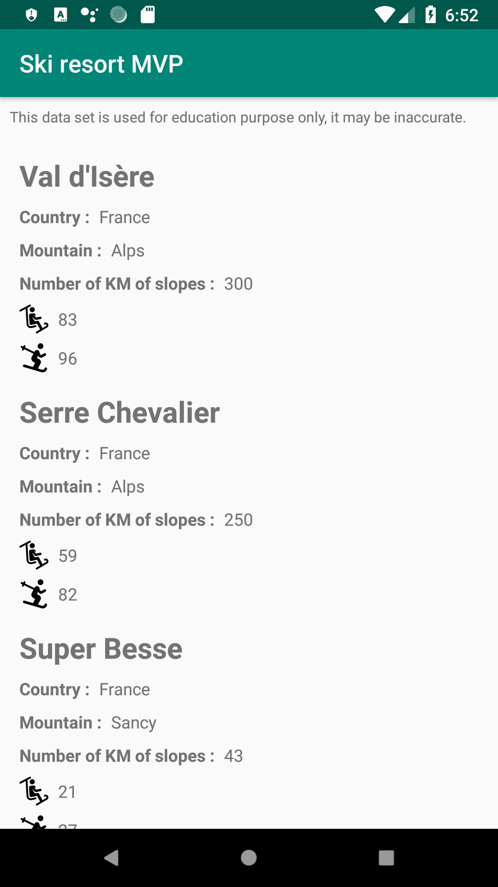
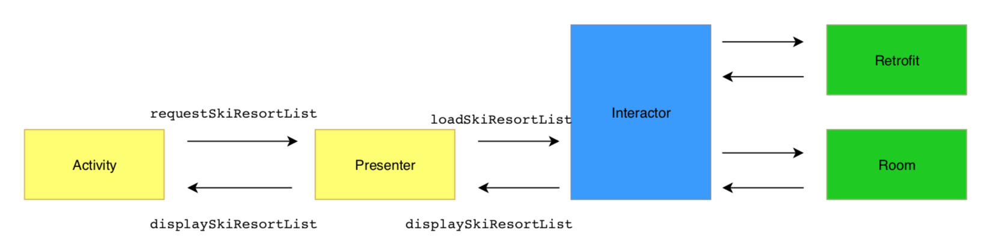

# ski-resort-mvp
Simple project to display a list of ski resort with the MVP pattern.

### This app has one screen that display a list of ski resort around the world.

Disclaimer : This data set is used for education purpose only, it may be inaccurate.

### The purpose of this project is to showcase the following Android project architecture with Clean Architecture approach.

- Activity should include only code related to data binding.

- Presenter will handle the display logic.

- Interactor will request data to the data sources.

- DAO classes are using Room to make SQL requests.

- Retrofit is used to download data.